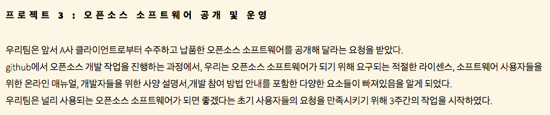
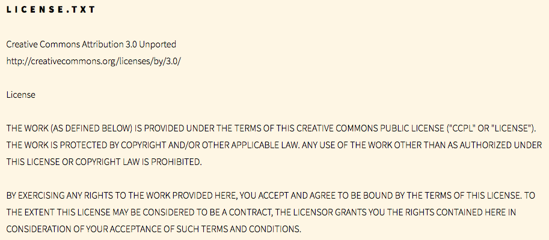
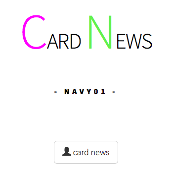
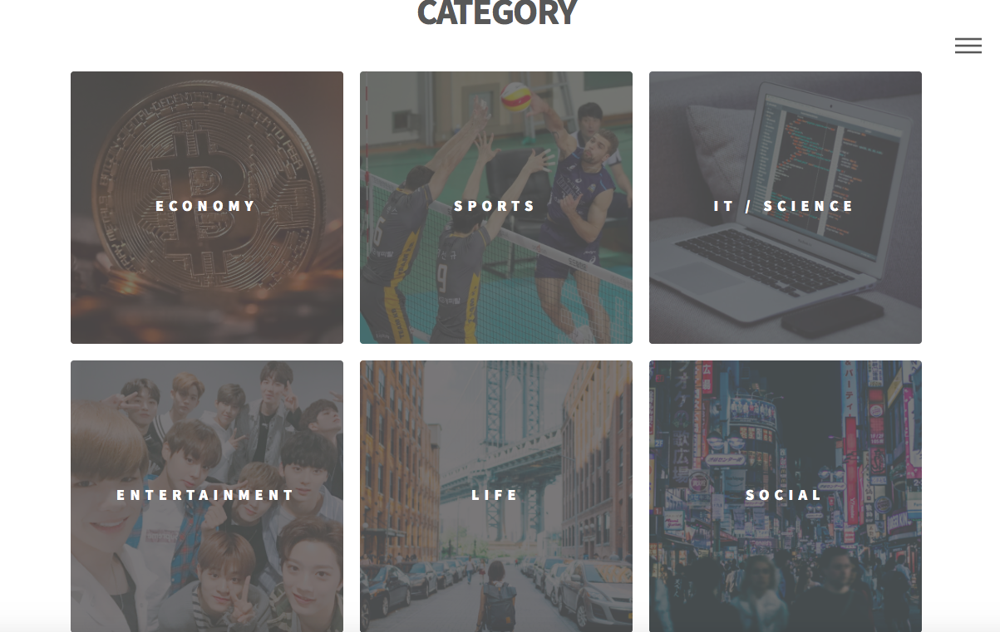
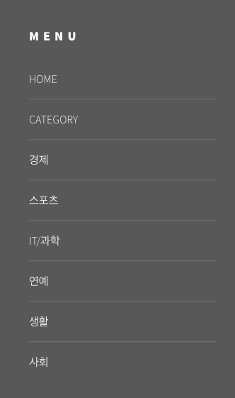
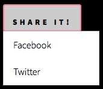
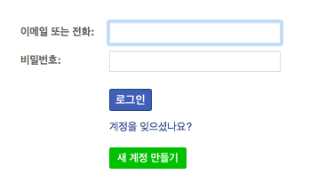
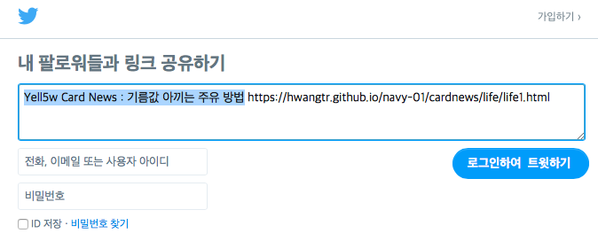
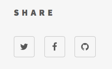

## ● 메인화면
----------------

페이지의 주소를 통해서 홈페이지의 메인 페이지를 보면
상단바에서 **HOME**, **ABOUT**, **CONTACT** 세 가지의 카테고리를 볼 수 있다.

  

ABOUT에는 프로젝트에 대한 자료, 사용한 오픈소스에 관한 라이센스들이 명시되어있다.

CONTACT에는 개발자들의 이메일 주소가 있어서, 언제든지 문의사항을 넣을 수 있다.

그리고 HOME버튼을 통해서 쉽게 메인 페이지로 돌아갈 수 있다.

## ● 카드뉴스 읽기
----------------

카드뉴스를 보기 위해서는 첫 화면 중간에 있는 card news 버튼을 클릭하면 된다.

그럼 경제, 스포츠, IT/과학, 연예, 생활, 사회 총 6개로 분류된 CATEGORY들이 있다.

각 섹션을 눌러서 주제와 관련된 카드뉴스를 볼 수 있다.

우측 상단에 있는 메뉴 버튼을 클릭하면 6개의 카테고리와 홈 화면이 메뉴로 정리되어 있다.

이를 통해 편리하게 페이지를 이동할 수 있다.

## ● 공유
-----------------

원하는 카드뉴스를 클릭하면 왼쪽 상단에 SHARE IT!이라는 버튼이 있다.

여기서 트위터 또는 페이스북을 선택하여 본인 아이디로 로그인 후 쉽게 공유할 수 있다.

*또는 페이지 하단에 있는 아이콘을 눌러서 홈페이지 자체를 공유할 수 있다.

